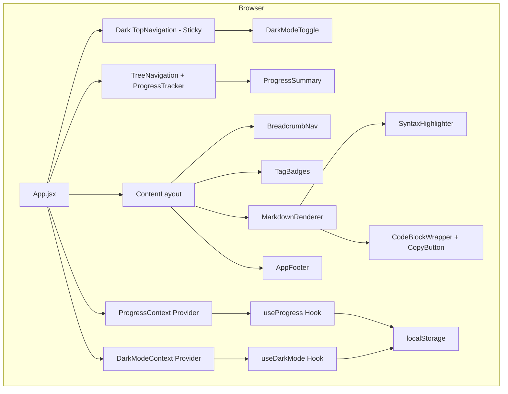

# Design Document: Learning App Enhancements

## Overview

This design document defines the technical design for 8 feature improvement requirements for the Amazon Bedrock AgentCore learning app. The current app is built with React 18 + Vite 6, uses the Cloudscape Design System, and has a single-page structure that renders static Markdown files.

Key improvement areas:
1. **UI Enhancement**: Unified styling based on Cloudscape design tokens, module transition effects
2. **Learning Progress Tracking**: localStorage-based per-module completion state management and progress display
3. **Code Block Copy**: Hover-triggered copy button and clipboard API integration
4. **Code Syntax Highlighting**: Language-specific syntax highlighting based on react-syntax-highlighter/Prism
5. **Layout Stability**: Sticky header/sidebar, independent scroll areas
6. **UI Redesign**: Hierarchical navigation, dark mode, and breadcrumbs in a modern learning platform style

## Architecture

### System Architecture



### Design Principles

- **Leverage existing Cloudscape AppLayout**: AppLayout already provides sticky header/sidebar by default, so no additional CSS is needed
- **Component separation**: Separate rendering logic within MarkdownRenderer into dedicated components
- **Context API-based state management**: Share progress tracking and dark mode state via React Context to avoid prop drilling
- **Progressive Enhancement**: Provide fallbacks when clipboard API, localStorage, etc. are unavailable
- **Hierarchical navigation**: Convert flat list to tree structure to improve content organization

## Components and Interfaces

### 1. ProgressContext (New)

A React Context that shares progress tracking state across the entire app.

```jsx
// src/contexts/ProgressContext.jsx

/**
 * @typedef {Object} ModuleProgress
 * @property {boolean} completed - Whether completed
 * @property {string|null} completedAt - ISO 8601 completion timestamp (null = incomplete)
 */

/**
 * @typedef {Object} ProgressContextValue
 * @property {Record<string, ModuleProgress>} progress - Per-module progress state
 * @property {function(string): void} toggleModule - Toggle module completion
 * @property {number} completedCount - Number of completed modules
 * @property {number} totalCount - Total number of modules
 * @property {number} percentage - Progress percentage (0~100)
 */
```

**Interface:**
- `ProgressProvider`: A Provider component placed at the App top level
- `useProgress()`: A custom Hook for consuming the Context

**localStorage key:** `agentcore-learning-progress`  
**Storage format:** `JSON.stringify(Record<moduleId, ModuleProgress>)`

### 2. ProgressSummary (New)

A component that displays overall progress summary at the top of the sidebar.

```jsx
// src/components/ProgressSummary.jsx

/**
 * @props
 * - completedCount: number
 * - totalCount: number
 * - percentage: number
 */
```

Uses the Cloudscape `ProgressBar` component for visual progress display.

### 3. ModuleCompletionToggle (New)

A completion checkbox displayed at the top of each module content view.

```jsx
// src/components/ModuleCompletionToggle.jsx

/**
 * @props
 * - moduleId: string
 * - completed: boolean
 * - onToggle: () => void
 */
```

Uses the Cloudscape `Toggle` or `Checkbox` component.

### 4. CodeBlockWrapper (New)

A wrapper component that integrates the copy button and syntax highlighting around code blocks.

```jsx
// src/components/CodeBlockWrapper.jsx

/**
 * @props
 * - code: string - Code text content
 * - language: string|undefined - Language identifier
 */
```

**Responsibilities:**
- If `language` is `mermaid`: Apply regular syntax highlighting (legacy compatibility — no diagram rendering)
- If `language` is a supported language: Apply syntax highlighting with `react-syntax-highlighter` Prism
- If `language` is not provided: Render as plain text
- In all cases: Show copy button on hover

### 5. CopyButton (New)

A copy button displayed in the upper-right corner of code blocks.

```jsx
// src/components/CopyButton.jsx

/**
 * @props
 * - text: string - Text to copy
 */
```

**Behavior flow:**
1. Attempt `navigator.clipboard.writeText(text)`
2. On failure, fallback: Create temporary `<textarea>` → Execute `document.execCommand('copy')`
3. On success: Change button state to "Copied" → Restore original state after 2 seconds

### 6. MarkdownRenderer (Existing - Modified)

Customizes `code` elements using ReactMarkdown's `components` prop.

```jsx
// Modified structure
<ReactMarkdown
  remarkPlugins={[remarkGfm]}
  rehypePlugins={[rehypeRaw]}
  components={{
    code: ({ node, inline, className, children, ...props }) => {
      // inline code → maintain existing style
      // block code → delegate to CodeBlockWrapper
    }
  }}
>
```

**Changes:**
- Add `code` component custom renderer
- Convert Mermaid post-processing logic from `useEffect` → component-based
- Remove MermaidRenderer component (Mermaid dependency fully removed)
- Change `language === 'mermaid'` branch to process as regular code block (legacy mermaid blocks render as syntax-highlighted plain code)

### 8. TreeNavigation (New — Requirement 7)

A hierarchical tree navigation component that replaces the existing flat SideNavigation.

```jsx
// src/components/TreeNavigation.jsx

/**
 * @props
 * - navigationTree: NavigationNode[] - Hierarchical navigation data
 * - activeItemId: string - Currently selected item ID
 * - onItemSelect: (id: string) => void - Item selection callback
 */
```

**Implementation approach:**
- Use nested Cloudscape `ExpandableSection` components for 3-level tree structure
- Each level: Series (top) > Category (middle) > Individual items (leaf)
- Expand/collapse state managed via local component state
- Items with `isNew` flag set to true display "NEW" using Cloudscape `Badge` component

### 9. BreadcrumbNav (New — Requirement 7)

A breadcrumb component displaying the hierarchical path of the current page.

```jsx
// src/components/BreadcrumbNav.jsx

/**
 * @props
 * - activeItemId: string - Currently active item ID
 * - navigationTree: NavigationNode[] - Full navigation tree
 * - onNavigate: (itemId: string) => void - Navigation callback on breadcrumb segment click
 */
```

**Implementation:**
- Uses Cloudscape `BreadcrumbGroup` component
- Backtracks through the tree from `activeItemId` to build path array
- Format: `🏠 > [series/category] > [current page]`
- Navigation to corresponding level on segment click

```jsx
function buildBreadcrumbPath(tree, targetId) {
  function findPath(nodes, path) {
    for (const node of nodes) {
      const currentPath = [...path, { text: node.title, id: node.id }];
      if (node.id === targetId) return currentPath;
      if (node.children) {
        const result = findPath(node.children, currentPath);
        if (result) return result;
      }
    }
    return null;
  }
  return findPath(tree, [{ text: '🏠', id: 'home' }]);
}
```

### 10. TagBadges (New — Requirement 7)

A component that displays technology keywords related to content as colored badges.

```jsx
// src/components/TagBadges.jsx

/**
 * @props
 * - tags: Tag[] - Tag array [{ label: string, category: string }]
 */
```

**Color mapping:**
```jsx
const TAG_COLORS = {
  sdk: '#0972d3',        // Blue (SDK-related)
  service: '#e07941',    // Orange (AWS services)
  concept: '#037f0c',    // Green (core concepts)
  tool: '#8b5cf6',       // Purple (tools/utilities)
  default: '#5f6b7a',    // Gray (other)
};
```

Uses Cloudscape `SpaceBetween` + custom styled `<span>` or Cloudscape `Badge` component.

### 11. AppFooter (New — Requirement 7)

A copyright and branding information display area at the bottom of the page.

```jsx
// src/components/AppFooter.jsx

/**
 * Fixed content:
 * - © 2025 Kiro - Amazon Bedrock AgentCore Learning
 */
```

Placed at the bottom of ContentLayout. Implemented as a simple `<footer>` element.

### 12. DarkModeToggle (New — Requirement 7)

A dark mode/light mode toggle switch.

```jsx
// src/components/DarkModeToggle.jsx

/**
 * @props
 * - darkMode: boolean - Current dark mode state
 * - onToggle: () => void - Toggle callback
 */
```

**Implementation:**
- Uses `applyMode` function from Cloudscape `@cloudscape-design/global-styles`
- Calls `applyMode(Mode.Dark)` / `applyMode(Mode.Light)`
- Stores `'dark'` or `'light'` in localStorage key `agentcore-dark-mode`
- Placed as a toggle button within the TopNavigation utilities prop

### 13. DarkModeContext (New — Requirement 7)

A React Context that shares dark mode state across the entire app.

```jsx
// src/contexts/DarkModeContext.jsx

/**
 * @typedef {Object} DarkModeContextValue
 * @property {boolean} isDarkMode - Whether dark mode is currently active
 * @property {function(): void} toggleDarkMode - Dark mode toggle function
 */
```

**Initialization logic:**
1. Read `agentcore-dark-mode` key from localStorage
2. If value exists, apply that mode
3. If no value exists, reference system default (prefers-color-scheme) or default to light

## Data Model

### ProgressState

```typescript
// Type definitions (implementation uses JSDoc)

interface ModuleProgress {
  completed: boolean;
  completedAt: string | null;  // ISO 8601 timestamp, null if incomplete
}

interface ProgressState {
  [moduleId: string]: ModuleProgress;
}

// localStorage storage example:
// Key: "agentcore-learning-progress"
// Value: {
//   "M00-CourseIntro_Summary": { "completed": true, "completedAt": "2025-01-15T09:30:00Z" },
//   "M01-Foundations_Summary": { "completed": false, "completedAt": null },
//   ...
// }
```

### Module ID List

Uses the `id` field from the existing PAGES array as module identifiers:
- `M00-CourseIntro_Summary`
- `M01-Foundations_Summary`
- `M02-Runtime_Summary`
- `M03-SecurityAndIdentity_Summary`
- `M04-ToolsAndGateway_Summary`
- `M05-Memory_Summary`
- `M06-DeploymentObservability_Summary`
- `M07-NewFeatures_Summary`
- `L01-AgentCore_Lab`

### NavigationTree (New — Requirement 7)

A hierarchical navigation data structure that replaces the existing flat PAGES array.

```typescript
interface Tag {
  label: string;
  category: 'sdk' | 'service' | 'concept' | 'tool';
}

interface NavigationNode {
  id: string;
  title: string;
  type: 'series' | 'category' | 'item';
  isNew?: boolean;
  tags?: Tag[];
  contentFile?: string;  // leaf items only (e.g., "M01-Foundations_Summary.md")
  children?: NavigationNode[];
}

// Data example:
const NAVIGATION_TREE: NavigationNode[] = [
  {
    id: 'series-agentcore',
    title: 'Amazon Bedrock AgentCore',
    type: 'series',
    children: [
      {
        id: 'cat-foundations',
        title: 'Agent Foundations',
        type: 'category',
        children: [
          {
            id: 'M00-CourseIntro_Summary',
            title: 'Course Introduction',
            type: 'item',
            contentFile: 'M00-CourseIntro_Summary.md',
            tags: [{ label: 'Amazon Bedrock', category: 'service' }],
          },
          {
            id: 'M01-Foundations_Summary',
            title: 'AgentCore Foundations',
            type: 'item',
            contentFile: 'M01-Foundations_Summary.md',
            tags: [
              { label: 'Strands Agents SDK', category: 'sdk' },
              { label: 'Amazon Bedrock', category: 'service' },
            ],
            isNew: true,
          },
        ],
      },
      {
        id: 'cat-runtime',
        title: 'Runtime & Security',
        type: 'category',
        children: [
          {
            id: 'M02-Runtime_Summary',
            title: 'Runtime',
            type: 'item',
            contentFile: 'M02-Runtime_Summary.md',
            tags: [{ label: 'AgentCore Runtime', category: 'service' }],
          },
          // ... remaining items
        ],
      },
      // ... remaining categories
    ],
  },
];
```

### DarkMode State

```typescript
type ThemeMode = 'dark' | 'light';

// localStorage storage
// Key: "agentcore-dark-mode"
// Value: "dark" | "light"
```

## Correctness Properties

*A property refers to a characteristic or behavior that must be true in all valid executions of the system. Essentially, it is a formal statement about what the system should do. Properties serve as a bridge between human-readable specifications and mechanically verifiable correctness guarantees.*

### Property 1: Progress persistence round-trip

For *any* valid progress state (a mapping from module IDs to completion states with optional timestamps), serializing the state to localStorage and then deserializing on app reload SHALL produce an identical progress state.

**Validates: Requirements 2.1, 2.6**

### Property 2: Completion toggle preserves data integrity

For *any* module in any completion state (completed or incomplete), toggling the completion state SHALL:
- When switching to completed: Produce a state with `completed: true` and a non-null ISO 8601 `completedAt` timestamp
- When switching to incomplete: Produce a state with `completed: false` and `completedAt: null`
- Toggling twice SHALL restore the module to its original completion state (except for timestamp changes)

**Validates: Requirements 2.2, 2.3**

### Property 3: Progress calculation correctness

For *any* K modules marked as completed out of N total modules (0 ≤ K ≤ N), the progress tracker SHALL report `completedCount` as K and `percentage` as `Math.round((K / N) * 100)`.

**Validates: Requirements 2.4, 2.5**

### Property 4: Copy preserves code content

For *any* string representing code block content, invoking the copy operation SHALL place that string byte-for-byte on the system clipboard without modification, truncation, or encoding changes.

**Validates: Requirements 3.2**

### Property 5: Syntax highlighting tokenization

For *any* supported language identifier and non-empty code string, the syntax highlighter SHALL produce a rendered output containing at least one styled token element (a span with color/class) confirming that language-specific parsing was applied.

**Validates: Requirements 4.1**

### Property 7: Dark mode persistence round-trip

For *any* dark mode setting ("dark" or "light"), saving the setting to localStorage and then reading it back during app initialization SHALL produce the same mode setting, and the UI SHALL reflect that mode state.

**Validates: Requirements 7.13, 7.14, 7.15**

### Property 8: Breadcrumb path computation

For *any* active item in the navigation tree, the breadcrumb component SHALL produce a path array where each segment corresponds to an ancestor of that item from root to leaf, and the last segment matches the active item's title.

**Validates: Requirements 7.7**

### Property 9: Tag badges render with correct category colors

For *any* tag with a defined category, the rendered badge element SHALL have a background color matching the color assigned to that category in the TAG_COLORS mapping, and the badge text SHALL be identical to the tag's label.

**Validates: Requirements 7.9, 7.10**

### Property 10: NEW badge rendering

For *any* navigation item, a NEW badge SHALL be rendered if and only if the item's `isNew` property is true. Items with `isNew` set to false or undefined SHALL NOT display a NEW badge.

**Validates: Requirements 7.5**

### Property 11: Legacy mermaid blocks render as plain code

For *any* code block with a "mermaid" language identifier, the MarkdownRenderer SHALL render it as a syntax-highlighted code block (not a diagram), producing output that contains the original code text without SVG or diagram rendering.

**Validates: Requirements 8.8, 8.9**

## Error Handling

### localStorage-related Errors

| Scenario | Handling Approach |
|---------|----------|
| localStorage inaccessible (private browsing, quota exceeded) | Initialize all modules as incomplete, maintain state in memory only, ignore error |
| Stored data JSON parsing fails | Ignore existing data, reset to initial state, log console.warn |
| Stored data schema mismatch (missing fields, etc.) | Fill missing fields with default values, continue normal operation |

### Clipboard API Errors

| Scenario | Handling Approach |
|---------|----------|
| navigator.clipboard not supported | document.execCommand('copy') fallback |
| execCommand fails | Visual error feedback to user (button shake, etc.) |
| Non-HTTPS environment | Fallback method applied automatically |

### General Error Strategy

- Set timeout on all external service calls (10 seconds)
- Ensure graceful degradation without app crashes for users
- Support developer debugging via console.error

### Dark Mode-related Errors (Requirement 7)

| Scenario | Handling Approach |
|---------|----------|
| Failed to read dark mode setting from localStorage | Apply light mode default |
| `applyMode` call fails | Apply manual fallback based on CSS variables |
| Stored value is something other than 'dark'/'light' | Correct to light mode default |

### Mermaid → D2 Transition-related Errors (Requirement 8)

| Scenario | Handling Approach |
|---------|----------|
| Legacy mermaid code blocks remain | Render as syntax-highlighted plain code (no diagram conversion) |
| Kroki rendering fails after D2 conversion | Same D2Renderer error handling (original code + error border) |

## Test Strategy

### Test Framework

- **Unit/Property Tests**: Vitest + fast-check (property-based testing)
- **Component Tests**: Vitest + @testing-library/react
- **Integration Tests**: Vitest + jsdom environment

### Property-Based Tests (fast-check)

Each property test runs a minimum of 100 iterations, with Property references from the design document marked as tags.

| Property | Test Description | Tag |
|----------|-----------|-----|
| Property 1 | Serialize arbitrary progress state → save to localStorage → deserialize and verify identity | Feature: learning-app-enhancements, Property 1: Progress persistence round-trip |
| Property 2 | From arbitrary module ID and initial state: toggle once → verify state change, toggle twice → verify original state restoration | Feature: learning-app-enhancements, Property 2: Completion toggle preserves data integrity |
| Property 3 | Set 0~9 arbitrary modules as completed → verify completedCount and percentage calculation results | Feature: learning-app-enhancements, Property 3: Progress calculation correctness |
| Property 4 | Pass arbitrary string (including Unicode) to copy function → verify identity with clipboard contents | Feature: learning-app-enhancements, Property 4: Copy preserves code content |
| Property 5 | Select arbitrary supported language + arbitrary code string → verify styled tokens exist in highlighter output | Feature: learning-app-enhancements, Property 5: Syntax highlighting tokenization |
| Property 7 | Arbitrary mode value ("dark"/"light") → save to localStorage → read → verify same mode restoration | Feature: learning-app-enhancements, Property 7: Dark mode persistence round-trip |
| Property 8 | Select arbitrary tree item → buildBreadcrumbPath → verify path segments match actual ancestor path | Feature: learning-app-enhancements, Property 8: Breadcrumb path computation |
| Property 9 | Arbitrary tag array (with categories) → render → verify each badge's color matches TAG_COLORS mapping | Feature: learning-app-enhancements, Property 9: Tag badges render with correct category colors |
| Property 10 | Arbitrary navigation item (isNew true/false) → render → verify NEW badge presence matches isNew | Feature: learning-app-enhancements, Property 10: NEW badge rendering |
| Property 11 | Arbitrary code string + language="mermaid" → MarkdownRenderer → verify no SVG in result + original code text present | Feature: learning-app-enhancements, Property 11: Legacy mermaid blocks render as plain code |

### Unit Tests (Example-Based)

- Write individual test cases for each Requirement's EXAMPLE/EDGE_CASE classified items
- Primary targets:
  - Copy button state restoration after 2 seconds (timer mock)
  - Mermaid code block rendered as plain code verification (Requirement 8)
  - localStorage corruption initialization behavior
  - Clipboard API fallback behavior
  - Responsive breakpoint behavior
  - Dark TopNavigation renders all required elements (logo, avatar, language selector, dark mode toggle) verification
  - TreeNavigation 3-level nested rendering verification
  - TreeNavigation expand/collapse behavior verification
  - TreeNavigation header title "SKT - AX BootCamp" display verification
  - Breadcrumb segment click navigation behavior verification
  - Footer copyright/branding text verification
  - TreeNavigation drawer transition in mobile (≤768px) viewport verification

### Integration Tests

- AppLayout sticky behavior verification (scroll event simulation)
- Progress state persistence during module transitions verification
- Dark mode toggle triggers Cloudscape `applyMode` call and full UI theme change verification
- Mermaid dependency removal confirmation: verify no `import mermaid` or `require('mermaid')` statements in source

### Test Setup

```json
// vitest.config.js (additional configuration)
{
  "test": {
    "environment": "jsdom",
    "globals": true,
    "setupFiles": ["./src/test/setup.js"]
  }
}
```

Required devDependencies to add:
- `vitest`
- `@testing-library/react`
- `@testing-library/jest-dom`
- `fast-check`
- `jsdom`
