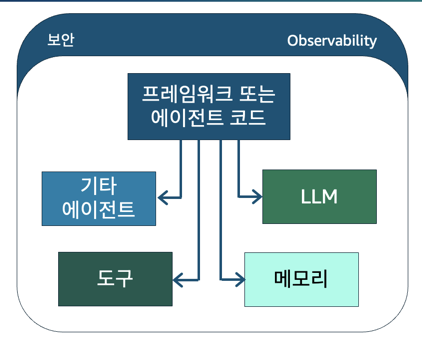

# 모듈 1: 에이전틱 AI 패턴의 기초 (Foundations of Agentic AI Patterns)

## Building Agentic AI with Amazon Bedrock AgentCore

---

## 목차

1. [에이전틱 AI 개요](#1-에이전틱-ai-개요)
2. [기존 AI vs 에이전틱 AI 비교](#2-기존-ai-vs-에이전틱-ai-비교)
3. [에이전트의 핵심 구성 요소](#3-에이전트의-핵심-구성-요소)
4. [에이전틱 루프 (Agentic Loop)](#4-에이전틱-루프-agentic-loop)
5. [Amazon Bedrock AgentCore 소개](#5-amazon-bedrock-agentcore-소개)
6. [AgentCore 핵심 서비스 상세](#6-agentcore-핵심-서비스-상세)
7. [배포 아키텍처](#7-배포-아키텍처)
8. [실전 에이전트 설계 예시](#8-실전-에이전트-설계-예시)
9. [지식 확인 및 핵심 정리](#9-지식-확인-및-핵심-정리)
10. [추가 Key Points - 강사 보충 자료](#10-추가-key-points---강사-보충-자료)

> 🆕 표시: 교재(v1.0.4, 2026년 4월 빌드) 이후 추가/변경된 내용
> 출처: [AgentCore Release Notes](https://docs.aws.amazon.com/bedrock-agentcore/latest/devguide/release-notes.html)

---

## 1. 에이전틱 AI 개요

### 에이전틱 AI란?

에이전틱 AI(Agentic AI)는 **자율적으로 의사결정을 내리고, 환경 변화에 적응하며,
목표를 향해 독립적으로 행동하는 AI 시스템**을 의미합니다.

### 핵심 특성

| 특성 | 설명 |
|------|------|
| **자율성 (Autonomy)** | 인간의 지속적 개입 없이 독립적으로 작업 수행 |
| **적응성 (Adaptability)** | 변화하는 조건과 새로운 정보에 동적으로 대응 |
| **목표 지향성 (Goal-oriented)** | 명확한 목표를 향해 계획을 수립하고 실행 |
| **도구 활용 (Tool Use)** | 외부 도구와 API를 활용하여 능력 확장 |
| **추론 능력 (Reasoning)** | 복잡한 문제를 분해하고 단계적으로 해결 |
| 🆕 **거래 능력 (Transact)** | API, 서비스에 자율적으로 접근하고 결제 |


### 왜 에이전틱 AI인가?

- **복잡한 워크플로 자동화**: 단순 Q&A를 넘어 다단계 작업을 자율적으로 수행
- **동적 의사결정**: 실시간 데이터와 컨텍스트에 기반한 판단
- **확장 가능한 지능**: 도구와 리소스를 조합하여 무한한 능력 확장
- **인간-AI 협업**: 인간은 전략적 결정에 집중, AI는 실행을 담당

### 에이전틱 AI의 성숙도 모델

| 레벨 | 단계 | 설명 | 예시 |
|------|------|------|------|
| L1 | **반응형 (Reactive)** | 단순 입력-출력, 상태 없음 | 챗봇, Q&A |
| L2 | **도구 사용 (Tool-augmented)** | 외부 도구 호출 가능 | RAG, Function Calling |
| L3 | **자율 실행 (Autonomous)** | 다단계 계획 및 실행 | 단일 에이전트 시스템 |
| L4 | **협업 (Collaborative)** | 멀티 에이전트 협업 | 에이전트 팀 |
| L5 | 🆕 **자율 거래 (Transacting)** | 자율적 서비스 접근 및 결제 | 에이전틱 커머스 |

---

## 2. 기존 AI vs 에이전틱 AI 비교

### 아키텍처 비교


```
┌──────────────────────────────────────────────────────────────────────┐
│ 기존 생성형 AI 애플리케이션                                                │
│                                                                      │
│   사용자 → 애플리케이션 → LLM → 응답 (단일 턴 대화)                           │
└──────────────────────────────────────────────────────────────────────┘

┌─────────────────────────────────────────────────────────────────────┐
│ 에이전틱 AI 애플리케이션                                                  │
│                                                                     │
│   ┌──────┐    ┌──────────────┐    ┌─────────────────────┐           │
│   │사용자│───▶│ 애플리케이션  │───▶│    에이전틱 루프            │           │
│   └──────┘    └──────────────┘    │  ┌──────┐           │           │
│                                   │  │ 추론 │           │            │
│                                   │  ├──────┤           │           │
│                                   │  │도구  │           │            │
│                                   │  │선택  │           │            │
│                                   │  ├──────┤           │           │
│                                   │  │ 실행 │           │            │
│                                   │  └──────┘           │           │
│                                   └────┬──────┬─────────┘           │
│                                        │      │                     │
│                                        ▼      ▼                     │
│                              ┌──────────┐  ┌──────────────┐         │
│                              │도구 및    │  │모델 간접 호출.   │         │
│                              │리소스     │  └──────────────┘          │
│                              └──────────┘                           │
└─────────────────────────────────────────────────────────────────────┘
```

### 상세 비교표

| 구분 | 기존 생성형 AI | 에이전틱 AI |
|------|---------------|------------|
| **상호작용 방식** | 단일 턴 요청-응답 | 다중 턴 자율 실행 |
| **제어 흐름** | 결정적(Deterministic) | 비결정적(Non-deterministic) |
| **도구 사용** | 없음 또는 제한적 | 동적 도구 선택 및 호출 |
| **메모리** | 세션 내 컨텍스트만 | 단기 + 장기 메모리 |
| **의사결정** | 인간이 모든 결정 | 에이전트가 자율적 결정 |
| **오류 처리** | 단순 재시도 | 적응적 전략 변경 |
| **복잡도** | 단순 파이프라인 | 복잡한 에이전틱 루프 |
| **확장성** | 수평적 스케일링 | 에이전트 간 협업으로 확장 |

---

## 3. 에이전트의 핵심 구성 요소

### 5가지 필수 아키텍처 구성 요소

에이전틱 시스템의 필수 아키텍처를 이루는 **5가지 핵심 구성 요소**:



### 각 구성 요소 상세

#### 1) 프레임워크 또는 에이전트 코드
- 에이전트의 오케스트레이션 로직을 담당
- 에이전틱 루프의 실행 흐름을 제어
- 예: Strands Agents SDK, LangChain, CrewAI, Google ADK, OpenAI Agents
- 🆕 **Managed Harness 옵션**: 프레임워크 없이 구성만으로 에이전트 실행 가능 (오케스트레이션 코드 불필요)

#### 2) LLM (대규모 언어 모델)
- 에이전트의 "두뇌" 역할
- 추론, 계획 수립, 도구 선택 결정
- 모델 독립적 설계가 중요 (특정 모델에 종속되지 않도록)
- 🆕 지원 모델: Bedrock(Claude, Nova, Llama, Mistral, Titan, Cohere), Anthropic Direct, OpenAI, Gemini

#### 3) 도구 (Tools)
- 에이전트의 능력을 확장하는 외부 기능
- API 호출, 데이터베이스 쿼리, 웹 검색, 코드 실행 등
- MCP(Model Context Protocol)를 통한 표준화된 통합
- 🆕 **AWS Agent Registry**를 통한 중앙 집중식 도구 검색 및 거버넌스

#### 4) 메모리 (Memory)
- **단기 메모리**: 현재 세션의 대화 컨텍스트
- **장기 메모리**: 세션 간 지속되는 학습된 정보
- 에이전트의 개인화와 연속성을 보장
- 🆕 **에피소드 메모리 전략** 추가, **메타데이터 필터링** 지원, **레코드 스트리밍** (이벤트 기반 알림)

#### 5) 에이전트 간 통신 (Agent-to-Agent, A2A)
- 멀티 에이전트 시스템에서의 협업
- 작업 위임 및 결과 공유
- 전문화된 에이전트 간의 오케스트레이션
- 🆕 **AG-UI 프로토콜**: 에이전트↔프론트엔드 실시간 스트리밍 (CopilotKit 파트너십)

---

## 4. 에이전틱 루프 (Agentic Loop)

### 에이전틱 루프의 작동 원리

에이전틱 루프는 에이전트가 목표를 달성할 때까지 반복하는 핵심 실행 패턴입니다.

```
┌──────────────┐
│ 사용자 입력     │
└──────┬───────┘
       ▼
┌──────────────┐
│ 1. 인식       │
│ (Perceive)   │
└──────┬───────┘
       ▼
┌──────────────┐
│ 2. 추론       │
│ (Reason)     │
└──────┬───────┘
       ▼
┌──────────────┐
│ 3. 행동       │
│ (Act)        │
└──────┬───────┘
       ▼
┌──────────────┐
│ 4. 관찰       │
│ (Observe)    │
└──────┬───────┘
       ▼
┌──────────────────┐     Yes     ┌────────────────┐
│ 목표 달성 여부?     │────────────▶│ 최종 응답 반환     │
└────────┬─────────┘             └────────────────┘
         │ No (루프 계속)
         └──────────────────────────▲
                                    │
         ┌──────────────────────────┘
         ▼
┌──────────────┐
│ 1. 인식      │ (반복)
└──────────────┘
```

### 루프 단계별 설명

| 단계 | 역할 | 상세 |
|------|------|------|
| **인식 (Perceive)** | 입력 수신 | 사용자 요청, 환경 변화, 도구 결과를 수집 |
| **추론 (Reason)** | 계획 수립 | LLM을 활용하여 다음 행동을 결정 |
| **행동 (Act)** | 실행 | 도구 호출, API 요청, 코드 실행 등 수행 |
| **관찰 (Observe)** | 결과 평가 | 행동의 결과를 분석하고 목표 달성 여부 판단 |

### ReAct 패턴 (Reasoning + Acting)

에이전틱 루프의 가장 대표적인 구현 패턴:

```
Thought: 사용자가 주문 상태를 물어보고 있다. 주문 번호를 확인해야 한다.
Action: get_order_status(order_id="12345")
Observation: 주문 #12345는 배송 중이며, 예상 도착일은 내일이다.
Thought: 주문 상태 정보를 얻었다. 사용자에게 알려줄 수 있다.
Answer: 주문 #12345는 현재 배송 중이며, 내일 도착 예정입니다.
```

### 비결정적 제어 흐름의 의미

- 동일한 입력에도 다른 경로를 선택할 수 있음
- LLM의 추론에 따라 도구 호출 순서와 횟수가 달라짐
- 이로 인해 **관찰성(Observability)**이 매우 중요
- 🆕 **Agent Performance Loop**: 프로덕션 트레이스를 분석하여 프롬프트/도구 설명을 자동 최적화하고, A/B 테스트로 검증


---

## 5. Amazon Bedrock AgentCore 소개

### 프로토타입에서 프로덕션까지의 간극

에이전트를 프로토타입에서 프로덕션으로 전환할 때 직면하는 5가지 핵심 과제:

| 과제 | 설명 |
|------|------|
| **성능 (Performance)** | 지연 시간, 처리량, 비용 최적화 |
| **보안 (Security)** | 인증, 권한 부여, 데이터 보호 |
| **거버넌스 (Governance)** | 정책 준수, 감사, 규정 관리 |
| **확장성 (Scalability)** | 트래픽 증가에 따른 자동 스케일링 |
| **컨텍스트 (Context)** | 메모리 관리, 상태 유지, 개인화 |

### AgentCore가 해결하는 문제

Amazon Bedrock AgentCore는 이러한 프로덕션 과제를 해결하기 위한
**완전관리형 에이전트 인프라 서비스**입니다.

핵심 가치:
- **프레임워크 독립적**: 어떤 에이전트 프레임워크든 지원
- **모델 독립적**: 어떤 LLM이든 사용 가능
- **엔드투엔드 관리**: 배포부터 모니터링까지 전체 수명주기 관리
- **보안 내장**: 인증/권한 부여가 기본 제공
- 🆕 **ISO/CSA STAR 인증** 획득, **GovCloud (US-West)** 지원으로 규제 워크로드 대응

### 서비스 타임라인

| 시기 | 이벤트 |
|------|--------|
| 2025년 7월 | Preview 출시 |
| 2025년 10월 | **GA (정식 출시)** - 9개 리전 |
| 2026년 1월 | 서울 리전 포함 5개 리전 확장 |
| 2026년 3월 | CLI GA, Evaluations GA, Policy GA |
| 2026년 4월 | 🆕 Managed Harness, Registry, Payments Preview |
| 2026년 5월 | 🆕 CDK Stable, MCP Sessions, 파일시스템, GovCloud |
| 2026년 6월 | 🆕 **NY Summit**: Harness GA, Web Search, Managed Knowledge Base, Guardrails 통합, Optimization (Insights/Recommendations/A/B) |

---

## 6. AgentCore 핵심 서비스 상세

### 서비스 아키텍처 전체 맵


### 6.1 AgentCore Runtime

**역할**: 에이전트의 서버리스 호스팅 및 실행 환경

- 컨테이너 기반 배포 또는 직접 코드(.zip) 배포 지원
- 자동 스케일링 (트래픽에 따른 인스턴스 조정)
- 프레임워크 독립적 (Strands, LangChain, CrewAI 등 모두 지원)
- 엔드포인트 관리 및 버전 관리

🆕 **최신 업데이트**:
- **Node.js Direct Code Deploy**: Python 외에 Node.js .zip 배포 지원
- **Managed Session Storage**: 세션 간 파일시스템 상태 유지 (1GB, 14일 보존)
- **Shell Command Execution** (`InvokeAgentRuntimeCommand`): microVM 내 셸 명령 직접 실행, HTTP/2 스트리밍 출력
- **Bring-Your-Own File System**: Amazon S3 Files, Amazon EFS 마운트 지원 (최대 5개)
- **AG-UI Protocol**: 프론트엔드 실시간 스트리밍 (텍스트, 추론 단계, 도구 호출)
- **OAuth WebSocket 인증**: 브라우저 JS 클라이언트 직접 인증
- **Python 3.14 지원**
- **지연 시간 25-35% 개선**: 인증 토큰 캐싱으로 순차 호출 최적화
- **VPC Egress**: 고객 VPC 내 프라이빗 리소스 접근

### 6.2 AgentCore Identity

**역할**: 에이전트의 인증(AuthN) 및 권한 부여(AuthZ) 관리

**인바운드 인증 (사용자 → 에이전트)**:
- "이 사용자는 누구인가?" (인증)
- "이 사용자는 이 에이전트를 호출할 수 있는가?" (권한 부여)

**아웃바운드 인증 (에이전트 → 외부 리소스)**:
- "이 에이전트는 자기가 주장하는 존재가 맞는가?" (에이전트 신원 확인)
- "이 에이전트는 사용자 대신 이 리소스에 액세스할 수 있는가?" (위임된 권한)

🆕 **최신 업데이트**:
- **OBO (On-Behalf-Of) Token Exchange**: 에이전트가 인증된 사용자를 대신하여 보호된 리소스에 접근 (다중 동의 흐름 불필요)
- **VPC Egress**: 고객 VPC 내 Identity Provider 연결 지원
- **추가 IAM 조건 키**: `RuntimeAuthorizerType`, `aws:VpceOrgID`

### 6.3 AgentCore Gateway

**역할**: 도구 검색, 통합, 라우팅을 위한 중앙 집중식 게이트웨이

- MCP(Model Context Protocol) 기반 표준 인터페이스
- 도구 나열(List), 도구 간접 호출(Invoke), 검색(Search) 기능
- **Zero-code MCP 도구 생성**: API/Lambda에서 코드 없이 MCP 도구 자동 생성
- 대상 유형:
  - **API 엔드포인트 대상**: RESTful API 서비스 연결
  - **AWS Lambda 대상**: 서버리스 함수 연결
  - **MCP 서버 대상**: 외부 MCP 서버 연결

🆕 **최신 업데이트 (2026년 5월 대규모 업데이트)**:
- **MCP Sessions**: 상태 유지 세션 (사용자별 스코핑, 최대 8시간 타임아웃)
- **Response Streaming (SSE)**: Server-Sent Events로 실시간 응답 전달 (이전: 전체 버퍼링 후 반환)
- **Elicitation Pass-Through**: 도구 실행 중 사용자 입력 요청 (Human-in-the-loop)
  - Form 모드: 구조화된 폼 ("이 환불을 진행하시겠습니까?")
  - URL 모드: OAuth 동의 페이지 등으로 리다이렉트
- **Sampling Messages**: MCP 서버가 도구 실행 중 LLM 호출 요청 가능
- **Progress/Logging Notifications**: 장시간 작업의 실시간 진행 상황 스트리밍
- **3LO (Three-Legged OAuth) GA**: 사용자별 토큰으로 외부 서비스 접근
- **VPC Egress**: 고객 VPC 내 프라이빗 리소스(EKS 호스팅 MCP 서버 등) 접근


### 6.4 AgentCore Policy

**역할**: 에이전트의 도구 호출에 대한 동적 정책 평가 및 제어

- **정책 작성**: 자연어를 Cedar 정책 언어로 변환 (NL2Cedar)
- **동적 정책 평가**: 실시간으로 도구 호출 허용/거부 결정
- **정책 수명 주기 관리**: 정책 생성, 업데이트, 삭제
- AgentCore Gateway 및 Observability와 통합
- 🆕 **2026년 3월 GA** - 13개 리전에서 프로덕션 사용 가능

### 6.5 AgentCore Memory

**역할**: 에이전트의 단기 및 장기 메모리 관리

| 메모리 유형 | 특성 | 용도 |
|------------|------|------|
| **단기 메모리** | 동기식, 세션 내 | 채팅 메시지, 이벤트 저장 |
| **장기 메모리** | 비동기식, 세션 간 | 시맨틱 검색, 사용자 기본 설정, 요약 |

**메모리 전략 (Memory Strategies)**:
- **시맨틱 메모리**: 의미 기반 검색 및 저장
- **사용자 기본 설정 메모리**: 개인화된 선호도 학습
- **요약 메모리**: 대화 내용의 압축 및 핵심 추출
- 🆕 **에피소드 메모리**: 특정 에피소드/이벤트 단위 기억

🆕 **최신 업데이트**:
- **Structured Metadata Filtering**: 메타데이터 속성(우선순위, 부서, 태그, 시간 범위)으로 장기 메모리 필터링 검색
- **Record Streaming**: 메모리 레코드 생성/수정/삭제 시 푸시 알림 (폴링 제거, 이벤트 기반)
- **Resource-Based Policies**: 메모리 리소스에 직접 정책 연결 (호출자 IAM 역할 수정 불필요)

### 6.6 AgentCore Observability

**역할**: 에이전트 수명 주기에 대한 완전한 가시성 제공

- OpenTelemetry(OTEL) 기반 계측
- Amazon CloudWatch 생성형 AI 관찰성 대시보드 통합
- 계층적 뷰: 에이전트 → 세션 → 트레이스 → 스팬
- Runtime 내부/외부 에이전트 모두 모니터링 가능

🆕 **최신 업데이트**:
- **Cross-Account Monitoring**: 중앙 모니터링 계정에서 최대 100,000개 로그 그룹 관찰 (최대 5개 모니터링 계정)
- **트레이스 지연 10초 미만**: 스팬+로그 완전 트레이스 즉시 조회
- **One-Click Enablement**: Memory/Gateway 원클릭 관찰성 활성화
- **X-Ray 무제한 리소스**: 와일드카드 지원으로 엔터프라이즈 스케일 제한 해제
- **UI 개선**: 반복 스팬 번들링, 시각적 아이콘, 인프라 노이즈 필터링

### 6.7 AgentCore Evaluations

**역할**: LLM 심사자(Judge)를 활용한 에이전트 성능 평가

- **온라인 평가**: 실시간 프로덕션 트래픽 샘플링 및 평가
- **온디맨드 평가**: 특정 상호작용에 대한 수시 평가
- 🆕 **2026년 3월 GA** - 프로덕션 사용 가능

🆕 **최신 업데이트**:
- **13개 내장 평가자**: 응답 품질, 안전성, 태스크 완료, 도구 사용
- **Ground Truth 지원**: 참조 답변, 행동 어설션, 예상 도구 실행 시퀀스 비교
- **Custom Evaluators**: LLM 기반 또는 코드 기반(Lambda) 평가 로직
- **Batch Evaluation**: 과거 세션 리플레이로 변경 전/후 점수 비교 (회귀 테스트)
- **User Simulation**: LLM 기반 가상 사용자로 다중 턴 대화 생성
- **Optimization**: 프로덕션 트레이스 분석 → 프롬프트/도구 설명 개선 추천 → A/B 테스트 검증
- **평가 지연 50% 개선**: 증분 상태 관리로 P90 처리 시간 대폭 단축


### 6.8 기본 제공 도구

#### AgentCore Browser
- 서버리스 브라우저 인프라
- 웹 탐색 및 워크플로 자동화
- 상호 작용, 콘텐츠 추출, 스크린샷 캡처
- 격리된 보안 환경에서 실행

🆕 **최신 업데이트**:
- **OS-Level Interaction**: 마우스, 키보드, 시스템 알림, 인쇄 대화상자 등 OS 수준 제어
- **Chrome Enterprise Policies**: 100+ 브라우저 동작 정책 구성
- **Custom Root CA**: 내부 서비스용 조직 서명 SSL 인증서 지원
- **프록시 구성**: IP 안정성, 기업 네트워크 통합
- **브라우저 프로필**: 쿠키/로컬 스토리지 세션 간 유지
- **브라우저 확장**: Chrome 확장 로드 (광고 차단, 인증 헬퍼 등)
- **Web Bot Auth (Preview)**: HTTP 요청 암호화 서명으로 CAPTCHA 감소

#### AgentCore Code Interpreter
- 격리된 환경에서 안전한 코드 실행
- 대규모 데이터 처리 및 분석
- 데이터 시각화 및 수학적 모델링
- 파일 처리 및 변환

🆕 **최신 업데이트**:
- **Node.js 런타임 지원**: JavaScript/TypeScript 실행 (사전 설치 라이브러리 포함)
- **Custom Root CA**: 내부 서비스 연결용 조직 인증서
- **LangChain Deep Agents 통합**: LangChain 공식 AWS 네이티브 샌드박스 제공자

### 🆕 6.9 AgentCore Payments (Preview)

**역할**: AI 에이전트의 자율적 결제 인프라

- Coinbase 및 Stripe와 파트너십으로 구축
- 에이전트가 API, MCP 서버, 웹 콘텐츠, 다른 에이전트에 대해 자율적으로 결제
- 스테이블코인 또는 법정화폐(fiat) 결제 지원
- 전체 결제 수명주기 관리: 지갑 인증 → 거래 실행 → 지출 거버넌스 → 관찰성

**의미**: 에이전트 경제(Agentic Commerce)의 시작 - 에이전트가 서비스를 발견하고, 평가하고, 실시간으로 결제하는 미래

### 🆕 6.10 AWS Agent Registry (Preview)

**역할**: 중앙 집중식 에이전트/도구 검색 및 거버넌스 카탈로그

- 에이전트, 도구, 스킬, MCP 서버, 커스텀 리소스를 등록 및 검색
- Console UI, API, 또는 MCP 서버로 IDE에서 직접 쿼리 가능
- IAM 및 OAuth(Custom JWT) 기반 접근 제어
- 프라이빗 거버넌스 카탈로그로 조직 내 에이전트 관리

### 🆕 6.11 AgentCore CLI (GA)

**역할**: 에이전트 전체 수명주기를 CLI로 관리

```bash
# 프로젝트 생성 (다양한 프레임워크 지원)
agentcore init --framework strands

# 로컬 개발 (핫 리로드 + Agent Inspector UI)
agentcore dev

# 기능 추가
agentcore add memory
agentcore add identity
agentcore add gateway

# 프로덕션 배포
agentcore deploy

# 모니터링
agentcore logs
agentcore traces

# 리소스 정리
agentcore teardown
```

**지원 프레임워크**: Strands, LangChain, Google ADK, OpenAI Agents, AutoGen

**Agent Inspector** (`agentcore dev` 실행 시):
- 브라우저 기반 UI로 에이전트와 채팅
- 토큰 사용량 및 도구 호출 실시간 검사
- 실행 트레이스 타임라인 시각화
- AgentCore Memory 브라우징


---

## 7. 배포 아키텍처

### 세 가지 배포 방식

#### 방식 1: 컨테이너 기반 배포
- **최대 유연성**: 커스텀 프레임워크, 복잡한 의존성
- Dockerfile로 이미지 빌드 → Amazon ECR 푸시 → Runtime 배포

```
에이전트 코드 + Dockerfile → 컨테이너 이미지 → ECR → Runtime 엔드포인트
```

#### 방식 2: 직접 코드 배포
- **빠른 배포**: .zip 파일로 간단히 배포
- 🆕 Python + **Node.js** 지원

```
에이전트 코드 (.zip) + Runtime 데코레이터 → Runtime 엔드포인트
```

#### 🆕 방식 3: Managed Harness (GA - 2026년 6월 NY Summit)
- **가장 빠른 경로**: 2개 API 호출(CreateHarness + InvokeHarness)로 에이전트 생성
- 오케스트레이션 코드 불필요 - 구성만으로 실행
- 추론, 도구 선택, 실행, 응답 스트리밍 자동 관리
- 격리된 microVM에서 실행
- 모든 모델 공급자 지원 (Bedrock, Anthropic, OpenAI, Gemini)

```
구성 파일 (모델 + 프롬프트 + 도구) → AgentCore가 에이전틱 루프 전체 관리
```

### 배포 방식 선택 가이드

| 기준 | 컨테이너 | 직접 코드 | 🆕 Managed Harness |
|------|----------|-----------|-------------------|
| **설정 복잡도** | 높음 | 중간 | 낮음 (2 API 호출) |
| **유연성** | 최대 | 중간 | 구성 범위 내 |
| **프레임워크** | 모두 가능 | Python/Node.js | 불필요 |
| **커스텀 의존성** | 자유 | 제한적 | 제한적 |
| **적합한 경우** | 복잡한 에이전트 | 빠른 프로토타입 | 최소 코드로 시작 |
| **파일시스템** | 🆕 S3/EFS 마운트 | 🆕 S3/EFS 마운트 | 🆕 S3/EFS + 세션 스토리지 |

### 배포 시 포함되는 구성 요소

| 구성 요소 | 설명 |
|-----------|------|
| Runtime 엔드포인트 구성 | 스케일링, 타임아웃, 리소스 설정 |
| Dockerfile | 컨테이너 이미지 정의 (컨테이너 방식만) |
| AgentCore Runtime 데코레이터 | 에이전트 진입점 정의 |
| AgentCore Observability 구성 | 모니터링 및 추적 설정 |
| AgentCore Identity 구성 | 인증/권한 부여 설정 |
| 🆕 파일시스템 구성 | S3 Files / EFS 마운트 설정 |

---

## 8. 실전 에이전트 설계 예시

### 고객 서비스 에이전트 아키텍처

```
┌─────────────────────────────────────────────────────────────────────┐
│ 고객 서비스 에이전트                                                     │
│                                                                     │
│  프레임워크: Strands Agents                                            │
│  모델: Amazon Bedrock (모든 모델)                                      │
│                                                                     │
│  ┌─ 도구 (Tools via Gateway) ─────────────────────────────────────┐  │
│  │  • get_product_info()    — 제품 정보 조회                         │ │
│  │  • get_return_policy()   — 반품 정책 조회                         │ │
│  │  • get_technical_support() — 기술 지원 정보                       │ │
│  │  • Web Browser           — 웹 탐색                               │ │
│  │  • 🆕 Elicitation        — 사용자 확인 요청                        │ │
│  └────────────────────────────────────────────────────────────────┘ │
│                                                                     │
│  ┌──────────────────┐  ┌──────────────────────────────────────┐     │
│  │ 단기 메모리      │  │ 장기 메모리                                │    │
│  │ (세션 컨텍스트)  │  │ (고객 선호도) 🆕 메타데이터 필터               │    │
│  └──────────────────┘  └──────────────────────────────────────┘    │
│                                                                    │
│  ┈┈┈┈┈┈┈┈┈┈┈┈┈┈┈┈┈┈┈┈┈┈┈┈┈┈┈┈┈┈┈┈┈┈┈┈┈┈┈┈┈┈┈┈┈┈┈┈┈┈┈┈┈┈┈┈┈┈┈       │
│  인프라: Runtime | Identity | Observability | Gateway                │
│          Policy | Evaluations | MCP                                │
│          🆕 Payments | Registry | CLI                              │
│  ┈┈┈┈┈┈┈┈┈┈┈┈┈┈┈┈┈┈┈┈┈┈┈┈┈┈┈┈┈┈┈┈┈┈┈┈┈┈┈┈┈┈┈┈┈┈┈┈┈┈┈┈┈┈┈┈┈┈┈       │
└────────────────────────────────────────────────────────────────────┘
```


### 에이전트 설계 시 고려사항

에이전트를 설계할 때 다음 질문에 답해야 합니다:

1. **에이전틱 AI로 무엇을 할 계획인가?** → 비즈니스 목표 정의
2. **어떤 AgentCore 서비스를 사용할 것인가?**
   - Runtime: 어떻게 배포할 것인가? (컨테이너 / 직접 코드 / 🆕 Harness)
   - Memory: 어떤 정보를 기억해야 하는가? (어떤 메모리 전략?)
   - Gateway: 어떤 도구가 필요한가? (🆕 Elicitation이 필요한가?)
   - Policy: 어떤 제약 조건이 있는가?
   - Identity: 누가 접근할 수 있는가? (🆕 OBO가 필요한가?)
   - Browser/Code Interpreter: 웹 탐색이나 코드 실행이 필요한가?
   - Observability: 무엇을 모니터링해야 하는가?
   - Evaluations: 성능을 어떻게 측정할 것인가? (🆕 어떤 평가자를 사용할 것인가?)
   - 🆕 Payments: 에이전트가 외부 서비스에 결제해야 하는가?
   - 🆕 Registry: 조직 내 에이전트/도구를 어떻게 관리할 것인가?

### 멀티 에이전트 패턴

프로덕션 환경에서 자주 사용되는 멀티 에이전트 아키텍처 패턴:

#### 패턴 1: 오케스트레이터-워커 (Orchestrator-Worker)
```
         ┌──────────────────┐
         │  오케스트레이터      │
         │    에이전트         │
         └───┬──────┬───┬───┘
             │      │   │
             ▼      ▼   ▼
    ┌────────┐ ┌────────┐ ┌────────┐
    │워커 A   │ │워커 B   │ │워커 C   │
    │(검색)   │ │(분석)   │ │(작성)   │
    └────────┘ └────────┘ └────────┘
```

#### 패턴 2: 파이프라인 (Pipeline)
```
┌───────────────┐    ┌───────────────┐    ┌───────────────┐    ┌──────────┐
│ 에이전트 A.     │───▶│ 에이전트 B      │───▶│ 에이전트 C       │───▶│최종 결과.  │
│ (데이터 수집)    │    │ (분석)         │    │ (보고서 작성)    │    └──────────┘
└───────────────┘    └───────────────┘    └───────────────┘
```

#### 패턴 3: 토론/합의 (Debate/Consensus)
```
┌────────────┐         ┌────────────┐
│ 에이전트 A   │◀───────▶│   에이전트 B │
└─────┬──────┘         └──────┬─────┘
      │                       │
      ▼                       ▼
      └───────┐   ┌──────────┘
              ▼   ▼
          ┌──────────┐
          │   합의    │
          └────┬─────┘
               ▼
          ┌──────────┐
          │최종 결정   │
          └──────────┘
```

---

## 9. 지식 확인 및 핵심 정리

### 지식 확인 문제

**문제 1**: 에이전틱 AI 솔루션의 필요성을 보여주는 주된 특징은?
- ✅ **정답: B** - 지속적 적응을 통한 주기적 의사 결정이라는 요구 사항
- 핵심: 자율적 결정 + 변화 적응 + 목표 지향 = 에이전틱 AI의 본질

**문제 2**: 에이전틱 시스템의 필수 아키텍처 5가지 구성 요소는?
- ✅ **정답: B** - 프레임워크/에이전트 코드, 메모리, 도구, LLM, 에이전트 간 통신
- 핵심: 서비스(Runtime, Policy 등)는 인프라이지, 에이전트 자체의 구성 요소가 아님

### 모듈 학습 목표 달성 확인

이 모듈을 완료하면 다음을 수행할 수 있습니다:
- ✅ 에이전틱 AI의 특성을 정의하고 기존 AI 시스템과의 차이를 이해
- ✅ 핵심 에이전트 구성 요소와 요소 간 상호 작용을 파악
- ✅ Bedrock AgentCore 서비스가 어떻게 에이전틱 AI를 지원하는지 설명


---

## 10. 추가 Key Points - 강사 보충 자료

### 10.1 MCP (Model Context Protocol) 심화

MCP는 에이전트와 도구 간의 **표준화된 통신 프로토콜**입니다.

```
┌────────────────────┐         ┌────────────────────┐
│     에이전트       │◀───────▶│     MCP 서버          │
│  (MCP 클라이언트)   │  MCP    │   (도구 제공자)        │
└────────────────────┘Protocol └────────────────────┘
```

**MCP의 핵심 가치**:
- **표준화**: 도구 통합을 위한 일관된 인터페이스
- **검색 가능성**: 에이전트가 사용 가능한 도구를 동적으로 발견
- **상호 운용성**: 다양한 프레임워크와 도구 간의 호환성
- **보안**: 인증된 도구 접근 및 정책 기반 제어

🆕 **Stateful MCP (2026년 3월)**:
- MCP 서버가 세션 컨텍스트를 유지
- Elicitation: 워크플로 중간에 사용자 입력 수집
- Sampling: 도구 실행 중 서버가 LLM 호출 요청
- Progress Notifications: 장시간 작업의 실시간 진행 상황 전달

🆕 **AgentCore MCP Server (awslabs/mcp)**:
- Kiro, Claude Code, Cursor 등 MCP 클라이언트에서 AgentCore 직접 사용
- Runtime, Memory, Browser, Code Interpreter를 boto3 없이 호출
- AWS 기본 자격 증명 체인으로 인증

### 10.2 Strands Agents SDK 핵심 개념

Strands Agents는 AWS가 오픈소스로 제공하는 에이전트 프레임워크입니다.

**기본 구조**:
```python
from strands import Agent, tool

@tool
def get_weather(city: str) -> str:
    """도시의 현재 날씨를 조회합니다."""
    return f"{city}의 현재 날씨: 맑음, 25°C"

# 에이전트 생성
agent = Agent(tools=[get_weather])

# 에이전트 실행
response = agent("서울의 날씨를 알려주세요")
```

### 10.3 에이전트 설계 안티패턴

프로덕션 에이전트 구축 시 피해야 할 일반적인 실수:

| 안티패턴 | 문제점 | 올바른 접근 |
|----------|--------|------------|
| **과도한 자율성** | 예측 불가능한 행동, 비용 폭증 | Policy로 가드레일 설정 |
| **무한 루프** | 목표 달성 없이 반복 | 최대 반복 횟수, 타임아웃 설정 |
| **단일 거대 에이전트** | 복잡도 증가, 디버깅 어려움 | 전문화된 소규모 에이전트로 분리 |
| **메모리 무시** | 매번 처음부터 시작 | 적절한 단기/장기 메모리 활용 |
| **관찰성 부재** | 원인 파악 불가 | 처음부터 Observability 구성 |
| **보안 후순위** | 프로덕션 보안 사고 | Identity/Policy를 설계 초기부터 적용 |

### 10.4 프로덕션 체크리스트

에이전트를 프로덕션에 배포하기 전 확인 항목:

#### 보안
- [ ] AgentCore Identity 구성 (인바운드 + 아웃바운드)
- [ ] 최소 권한 원칙 적용 (IAM 정책)
- [ ] AgentCore Policy로 도구 호출 제한
- [ ] 🆕 VPC Egress 구성 (프라이빗 리소스 접근 시)
- [ ] 🆕 PrivateLink 구성 (엔터프라이즈 보안 요구 시)

#### 성능
- [ ] 적절한 타임아웃 설정
- [ ] 최대 루프 반복 횟수 제한
- [ ] 토큰 사용량 모니터링
- [ ] 자동 스케일링 구성
- [ ] 🆕 파일시스템 마운트 (공유 데이터 필요 시)

#### 관찰성
- [ ] AgentCore Observability 활성화
- [ ] CloudWatch 대시보드 구성
- [ ] 알람 설정 (오류율, 지연 시간)
- [ ] 🆕 Cross-Account Monitoring (멀티 계정 환경)

#### 품질
- [ ] AgentCore Evaluations 온라인 평가 구성
- [ ] 핵심 지표 정의 (목표 성공률, 유용성 등)
- [ ] 🆕 Batch Evaluation으로 회귀 테스트 파이프라인
- [ ] 🆕 User Simulation으로 엣지 케이스 발견
- [ ] 🆕 Optimization으로 프롬프트/도구 설명 자동 개선


### 10.5 비용 고려사항

프로덕션 에이전트 운영 시 비용 구조:

| 비용 요소 | 설명 | 최적화 방법 |
|-----------|------|------------|
| **LLM 호출** | 토큰 기반 과금 (입력 + 출력) | 프롬프트 최적화, 캐싱 |
| **루프 반복** | 반복 횟수 × LLM 호출 비용 | 최대 반복 제한, 효율적 도구 설계 |
| **도구 호출** | Lambda 실행, API 호출 비용 | 불필요한 호출 최소화 |
| **메모리** | 저장 및 검색 비용 | 적절한 TTL, 메모리 전략 최적화 |
| **Runtime** | 컴퓨팅 리소스 비용 | 적절한 인스턴스 크기, 자동 스케일링 |
| 🆕 **Harness** | microVM 실행 시간 | 토큰 예산/도구 호출 제한 설정 |

### 10.6 강의 토론 포인트

1. **"여러분의 조직에서 에이전틱 AI로 자동화할 수 있는 워크플로는?"**
   - 고객 서비스, 데이터 분석, 코드 리뷰, 인시던트 대응 등

2. **"에이전트에게 얼마나 많은 자율성을 부여해야 하는가?"**
   - Human-in-the-loop vs 완전 자율
   - 🆕 Gateway Elicitation으로 중간 확인 가능

3. **"프로토타입에서 프로덕션으로 전환할 때 가장 큰 도전은?"**
   - 보안, 확장성, 비용 관리, 관찰성
   - 🆕 AgentCore CLI로 이 간극을 줄일 수 있음

4. 🆕 **"에이전트가 자율적으로 결제하는 미래를 어떻게 생각하는가?"**
   - AgentCore Payments의 가능성과 거버넌스 과제

### 10.7 "기존 Bedrock Agents와 AgentCore의 차이는?"

학생들이 자주 묻는 질문:

| 구분 | Amazon Bedrock Agents | Amazon Bedrock AgentCore |
|------|----------------------|--------------------------|
| **접근 방식** | 완전관리형, 선언적 | 인프라 서비스, 개발자 제어 |
| **오케스트레이션** | AWS가 관리 | 개발자가 선택 (또는 🆕 Harness) |
| **프레임워크** | Bedrock 전용 | 모든 프레임워크 |
| **모델** | Bedrock 모델만 | 모든 모델 공급자 |
| **적합한 경우** | 빠른 시작, 단순 에이전트 | 복잡한 에이전트, 커스텀 로직 |
| **유연성** | 제한적 | 최대 |

### 🆕 10.8 New York Summit 2026 - 에이전트의 3가지 지식 계층

2026년 6월 17~18일 AWS Summit New York에서 AgentCore는 "에이전트가 더 많이 알고(know more),
더 멀리 도달하도록(reach more)" 하는 3가지 지식 계층을 발표했습니다. 핵심 메시지는
**"유능한 모델은 시작점일 뿐이며, 프로덕션 성능은 올바른 컨텍스트·리소스·피드백 루프에 대한
접근에서 나온다"**는 것입니다.

| 지식 계층 | 서비스 | 상태 | 설명 |
|-----------|--------|------|------|
| **조직 지식 (Organizational)** | Bedrock Managed Knowledge Base | GA | SharePoint, Google Drive, Confluence, S3 등의 비정형 데이터를 관리형 RAG로 연결. 벡터 스토어/임베딩/리랭킹을 AWS가 관리하며, Agentic Retriever가 다단계 쿼리를 계획·연결·평가 |
| **세계 지식 (World)** | Web Search on AgentCore | GA | 실시간 웹 정보를 고객 AWS 보안 경계 내에서 검색 (데이터 egress 없음) |
| **유료 지식 (Paid)** | AgentCore Payments + AWS WAF AI traffic monetization | Payments: Preview / WAF: GA | 에이전트의 자율 결제(소비자 측) + 콘텐츠 제공자의 과금(공급자 측) |

> **강의 포인트**: 이 발표는 기존 모듈의 개념을 확장합니다.
> - 조직 지식 / 세계 지식 → M04 (도구 및 Gateway, 기본 제공 도구)
> - 유료 지식 → M04 Payments, M03 아웃바운드 인증
> - 지속적 학습(Optimization) → M06 (관찰성 및 평가)
> - Guardrails 통합 → M03/M04 (보안 및 Policy)
> - Harness GA → M02 (Runtime 배포)

또한 **AWS Context**(출시 예정)가 발표되었습니다. 조직의 기존 데이터 간 관계를 지식 그래프로
자동 매핑하고, 에이전트가 런타임에 거버넌스된 데이터 관계·비즈니스 규칙·도메인 지식에 접근할 수
있는 에이전틱 검색을 제공합니다.

---

## 리전 가용성 (2026년 5월 기준)

```
GA 리전 (15개+):
├── 미주: US East (Virginia, Ohio), US West (Oregon), Canada (Central), São Paulo
├── 유럽: Frankfurt, Ireland, Stockholm, Paris, London
├── 아시아태평양: Tokyo, Singapore, Sydney, Mumbai, Seoul ✅
└── 정부: GovCloud (US-West)
```

> **참고**: 서울 리전(ap-northeast-2)은 2026년 1월부터 Runtime, Browser, Code Interpreter,
> Observability가 지원됩니다.

---

## 교재 대비 변경 요약

| 교재 내용 (v1.0.4) | 현재 상태 (2026년 5월) |
|---------------------|----------------------|
| 배포 방식 2가지 | **3가지** (+ Managed Harness) |
| CLI 없음 | **AgentCore CLI GA** |
| Payments 없음 | **AgentCore Payments Preview** |
| Registry 없음 | **AWS Agent Registry Preview** |
| Gateway: 기본 MCP | **MCP Sessions, SSE, Elicitation, Sampling** |
| Runtime: Python만 | **Python + Node.js** |
| Memory: 3가지 전략 | **4가지** (+ Episodic) + Metadata Filtering |
| Evaluations: 기본 | **GA** + Batch + Simulation + Optimization |
| Browser: 기본 웹 탐색 | **OS-Level, 프록시, 프로필, 확장, Chrome 정책** |
| 보안: IAM 기반 | **+ OBO, VPC Egress, ISO 인증, GovCloud** |
| (해당 없음) | 🆕 **NY Summit 2026**: Harness GA, Web Search, Managed Knowledge Base, Guardrails 통합, Optimization, WAF AI 트래픽 수익화 |

---

## 참고 자료

- [Amazon Bedrock AgentCore 공식 문서](https://docs.aws.amazon.com/bedrock-agentcore/latest/devguide/)
- [AgentCore Release Notes](https://docs.aws.amazon.com/bedrock-agentcore/latest/devguide/release-notes.html)
- [New in Amazon Bedrock AgentCore (NY Summit 2026)](https://aws.amazon.com/blogs/machine-learning/new-in-amazon-bedrock-agentcore-build-agents-with-broader-knowledge-and-continuous-learning/)
- [Top announcements of the AWS Summit in New York, 2026](https://aws.amazon.com/blogs/aws/top-announcements-of-the-aws-summit-in-new-york-2026/)
- [Strands Agents SDK GitHub](https://github.com/strands-agents/sdk-python)
- [AgentCore CLI GitHub](https://github.com/aws/agentcore-cli)
- [AgentCore MCP Server (awslabs/mcp)](https://github.com/awslabs/mcp)
- [Model Context Protocol (MCP) 사양](https://modelcontextprotocol.io/)
- [OpenTelemetry 공식 문서](https://opentelemetry.io/docs/)

---

*본 문서는 MLAGAC-10-KO-KR-M01-Foundations_InstructorDeck.pdf의 내용을 기반으로 작성되었으며,
🆕 표시된 내용은 2026년 5월 기준 최신 서비스 업데이트를 반영한 강사 보충 자료입니다.*

*문서 버전: 2.1 | 작성일: 2026-05-28 | 최종 수정: 2026-06-23 | 업데이트 기준: 2026년 6월 AWS Summit New York 반영*
